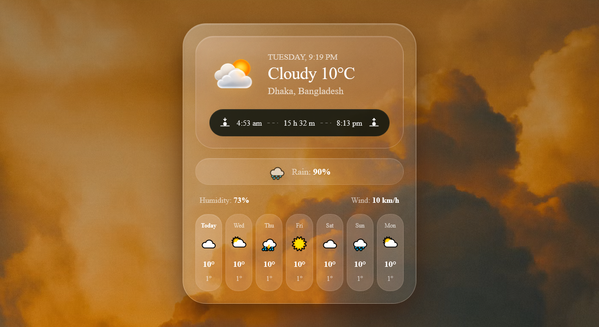

<p align="center">
  
</p>

<p align="center">
  <strong>A glassmorphism weather widget with a live real-time clock, layered frosted-glass sections, and a 7-day forecast strip — fully responsive.</strong>
</p>

# Weather App UI


A warm, glassy weather card UI — frosted blur sections, a glowing floating weather icon, sunrise/sunset tracker, and a 7-day forecast row. The date & time shown are live and update every second; the rest of the weather data is placeholder content ready to be wired to a real API.

> Built entirely in HTML, CSS, and JavaScript.

---

[](https://abdurrahman101bd.github.io/weather-app-ui)

---

## ✨ Features

- **Live real-time clock** — the weekday and time in the header update every second from the user's actual system clock, not a static placeholder
- **Glassmorphism design** — layered frosted-glass sections, glass shine overlay, and a warm golden-hour background
- **Floating weather icon** — subtle float + glow animation
- **Sunrise / sunset tracker** — pill-shaped bar with day-length readout
- **7-day forecast strip** — horizontally scaled forecast cards with a highlighted "Today" state
- **Fully responsive** — dedicated breakpoints scale the card, icons, and type down cleanly for tablets and small phones

---

## 🚀 Usage

Just open `index.html` in any modern browser — no build step, no dependencies to install.

```bash
git clone https://github.com/abdurrahman101bd/weather-app-ui.git
cd weather-app-ui
# then simply open index.html in your browser
```

---

## ⚠️ Note

Only the date/time is live. The condition, temperature, humidity, wind, sunrise/sunset times, forecast, and location are placeholder content. To make it fully live, connect a weather API (e.g. [OpenWeatherMap](https://openweathermap.org/api) or [WeatherAPI](https://www.weatherapi.com/)) in `script.js` and update those elements the same way `#datetime` is updated. You'll also need to add the referenced `sun icon.png` weather icon image to the project folder.

---

## 🛠️ Tech Stack
- Plain HTML, CSS, and JavaScript (no framework)
- Google Fonts (Inter)

[](https://developer.mozilla.org/en-US/docs/Web/HTML)
[](https://developer.mozilla.org/en-US/docs/Web/CSS)
[](https://developer.mozilla.org/en-US/docs/Web/JavaScript)

---

## 📄 License

This project is licensed under the MIT License — see the [LICENSE](LICENSE) file for details.

---

## 👤 Developer

**Abdur Rahman**

[](https://github.com/abdurrahman101bd)
[](mailto:abdurrahman101bd@gmail.com)

---

## 📞 Contact

[](https://github.com/abdurrahman101bd)
[](https://www.linkedin.com/in/abdurrahman101bd)
[](https://x.com/abdurrahman101b)
[](https://www.facebook.com/abdurrahman101bd)

---

<p align="center">
  Made with ❤️ by <a href="https://github.com/abdurrahman101bd">Abdur Rahman</a>
</p>


<p align="center">
  <a href="#weather-app-ui">Back to Top ⬆️</a>
</p>


